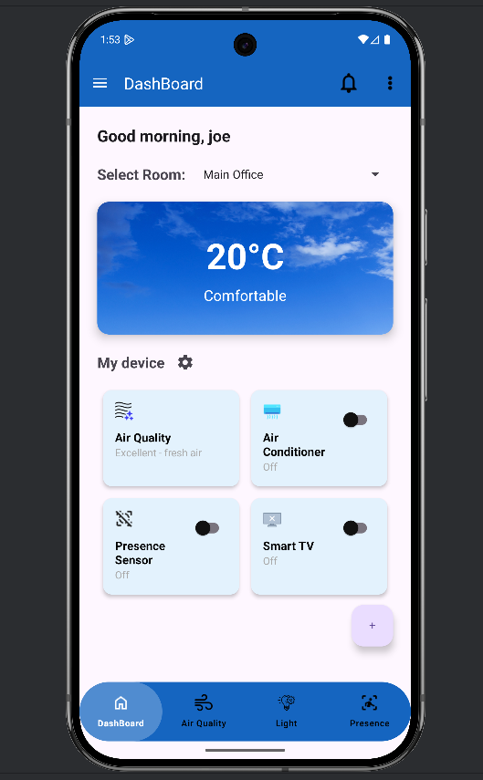
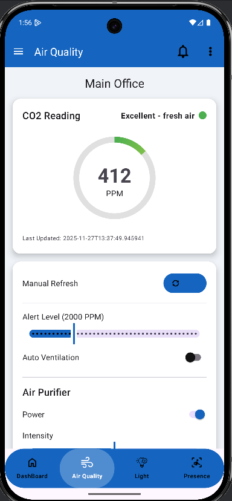
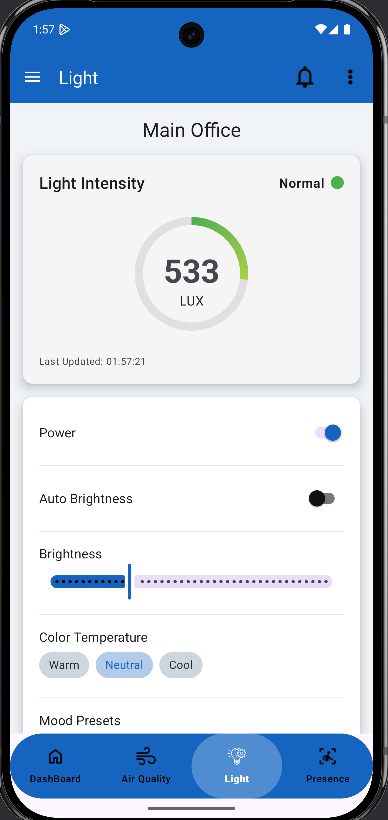
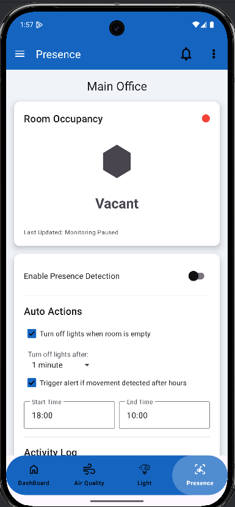
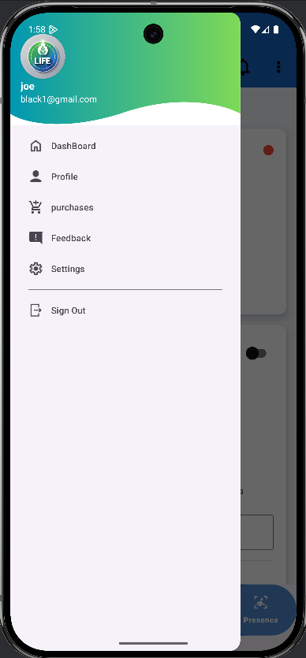
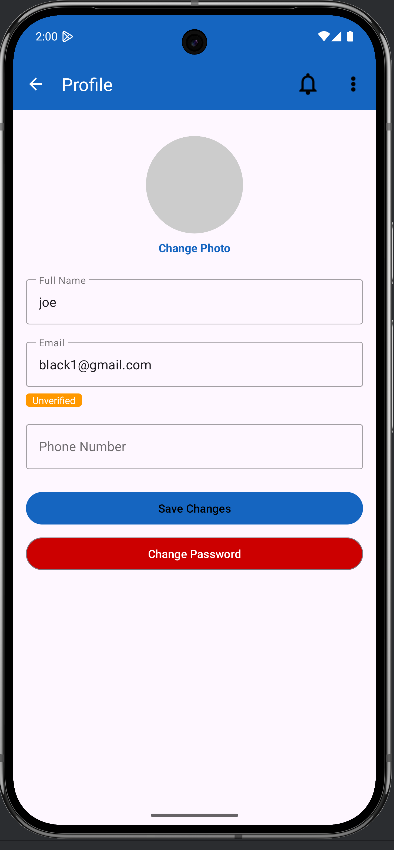

# Project Name: 
 LIFE Environmental Solutions

**Team Members:**
Mohamed Ali (ID: N01440760)
Jonathan Akabuike (ID: N01510573)
Kieran Sharma (ID: N01548225)
Farhan Habibzai (ID: N01610299)

## Description:
This project is an Android application developed in Java and XML.  
It demonstrates [A smart environmental monitoring system that improves indoor comfort, safety, and energy efficiency. It uses sensors to measure air quality (CO₂ and TVOCs), humidity, lighting levels, and human presence. The collected data is processed and displayed through an Android application, allowing users to monitor conditions in real time and take action when needed. This helps ensure healthier indoor environments, better energy savings, and overall improved quality of life in spaces such as classrooms, offices, and homes].

## Features:
- Real-time Air Quality Monitoring – Tracks CO₂ levels, TVOCs, and humidity to ensure a healthy indoor environment.

- Smart Presence Detection – Uses infrared human presence sensors to measure occupancy and optimize energy usage.

- Light Intensity Monitoring – Monitors visible light levels across six wavelength bands for comfort and energy savings.

## Project Screenshots:
| Dashboard | Air Quality | Light |
|---|---|---|
|  |  |  |

| Presence | Navigation Menu | Profile |
|---|---|---|
|  |  |  |

## Project Link:
[GitHub Repository](https://github.com/JonathanAkabuike0573/LIFE_EnvironmentalSolutions)  
