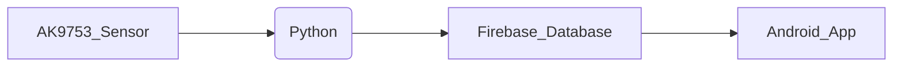

# AK9753 Human Presence Sensor - Complete Hardware Setup Guide

> **Complete instructions for building your own AK9753-based human presence monitoring system with Raspberry Pi, Firebase integration, and Android app connectivity**

## Table of Contents

1.  [Project Overview](#project-overview)
2.  [Bill of Materials (BOM)](#bill-of-materials-bom)
3.  [Hardware Assembly](#hardware-assembly)
4.  [Raspberry Pi Setup](#raspberry-pi-setup)
5.  [Firebase Configuration](#firebase-configuration)
6.  [Python Code Setup](#python-code-setup)
7.  [Android App Integration](#android-app-integration)
8.  [PCB Design (Optional)](#pcb-design-optional)
9.  [3D Printed Case (Optional)](#3d-printed-case-optional)
10. [Troubleshooting](#troubleshooting)

## Project Overview

This project creates a complete room occupancy and human presence monitoring system that:

- Detects **human presence** and **movement direction** using the AK9753 IR sensor
- Reads internal **temperature** from the sensor
- Transmits occupancy status (`OCCUPIED`/`VACANT`) to Firebase Firestore/Realtime DB
- Displays live status and session duration on an Android mobile app
- Supports remote monitoring from anywhere with internet connection

**System Architecture**


(I2C) (WiFi) (Cloud) (Mobile)

## Bill of Materials (BOM)

**Electronics Components**

Based on your DigiKey orders (same accessories as previous projects, but with the AK9753 sensor):

|     |                      |                      |                                               |                  |         |
|-----|----------------------|----------------------|-----------------------------------------------|------------------|---------|
| Qty | Part Number (DigiKey)| Manufacturer         | Description                                   | Unit Price (CAD) | Total   |
| 1   | **1568-1683-ND**     | SparkFun Electronics | **SparkFun Human Presence Sensor - AK9753**   | ~$25.00          | ~$25.00 |
| 1   | 1528-1783-ND         | Adafruit Industries  | Stacking Header for Raspberry Pi (2x20 GPIO)  | $4.30            | $4.30   |
| 1   | 455-1721-ND          | JST Sales America    | JST Connector Header RA 4POS 2mm (S4B-PH-K-S) | $0.22            | $0.22   |
| 1   | 1568-22726-ND        | SparkFun Electronics | Flexible Qwiic Cable - Female Jumper (4-pin)  | $2.84            | $2.84   |
| 1   | 1528-4528-ND         | Adafruit Industries  | 4-Pin STEMMA/GROVE to Qwiic Cable (400mm)     | $2.84            | $2.84   |
| 1   | 1528-5385-ND         | Adafruit Industries  | STEMMA QT/Qwiic Cable 400mm                   | $2.19            | $2.19   |
| 4   | 732-10422-ND         | Wurth Electronics    | M2.5x16mm Hex Standoffs (Steel)               | $1.02            | $4.08   |
| 4   | 145-50M025045I016-ND | Essentra Components  | M2.5x0.45 Machine Screws (Flat Phil)          | $0.22            | $0.88   |

**Subtotal:** ~$42.00 CAD (approx)

**Additional Required Items (Not in orders)**

|                  |                                                                         |             |
|------------------|-------------------------------------------------------------------------|-------------|
| Item             | Description                                                             | Est. Price  |
| **Raspberry Pi** | Raspberry Pi 4 Model B (2GB or 4GB recommended)                         | $45-55 USD  |
| **MicroSD Card** | 32GB or larger, Class 10                                                | $10-15 USD  |
| **Power Supply** | Official Raspberry Pi USB-C Power Supply (5V 3A)                        | $8-10 USD   |
| **Jumper Wires** | Male-to-Female jumper wires (if not using Qwiic)                        | $5-8 USD    |

**Total Project Cost:** ~$120-140 USD

## Hardware Assembly

**Option 1: Using Qwiic System (Recommended - No Soldering)**

The **easiest method** uses the SparkFun Qwiic ecosystem (Plug-and-Play):

**Step 1: Install Stacking Header on Raspberry Pi**
1.  If your Raspberry Pi doesn't have GPIO headers pre-installed, solder the **2x20 Stacking Header** onto the GPIO pins.
2.  This allows you to connect the AK9753 while keeping other GPIO pins accessible.

**Step 2: Connect AK9753 with Qwiic Cable**
1.  Take the **STEMMA QT/Qwiic Cable** (1528-5385-ND).
2.  Connect one end to the **Qwiic connector** on the AK9753 breakout board.
3.  Connect the other end to the Raspberry Pi GPIO pins (if using Qwiic-to-Female cable) or a Qwiic HAT:
    - **Red wire** → Pin 1 (3.3V Power)
    - **Black wire** → Pin 9 (Ground)
    - **Blue wire (SDA)** → Pin 3 (GPIO 2 - I2C SDA)
    - **Yellow wire (SCL)** → Pin 5 (GPIO 3 - I2C SCL)

**Qwiic Cable Pinout Reference**
```text
Qwiic/STEMMA QT Connector:
┌─────────────────┐
│ BLK RED BLU YEL │
│ GND 3V3 SDA SCL │
└─────────────────┘
```

**Raspberry Pi GPIO Pin Layout (Top View)**
```text
┌───────────────┐
3V3 │ 1 ● ● 2 │ 5V
SDA │ 3 ● ● 4 │ 5V
SCL │ 5 ● ● 6 │ GND
    │ 7 ● ● 8 │
GND │ 9 ● ● 10 │
    │ ...       │
└───────────────┘
```

**Option 2: Direct GPIO Connection (Manual Wiring)**

If you don't have Qwiic cables:
1.  Use **female-to-female jumper wires**.
2.  Connect AK9753 breakout pins to Raspberry Pi GPIO:

|            |            |                  |           |
|------------|------------|------------------|-----------|
| AK9753 Pin | Wire Color | Raspberry Pi Pin | Function  |
| **3V3**    | Red        | Pin 1 (3.3V)     | Power     |
| **GND**    | Black      | Pin 9 (Ground)   | Ground    |
| **SDA**    | Blue       | Pin 3 (GPIO 2)   | I2C Data  |
| **SCL**    | Yellow     | Pin 5 (GPIO 3)   | I2C Clock |

**Important Hardware Notes**

⚠️ **Critical Warnings:**
1.  **Use 3.3V only** - Do NOT connect to 5V; the AK9753 is not 5V tolerant.
2.  **Orientation**: Ensure the sensor side (the side with the small white square chip) is facing the area you want to monitor.
3.  **Field of View**: The sensor has 4 distinct quadrants (Up, Down, Left, Right). For best results, place it at chest/head height facing the room.

**AK9753 I2C Address**
- **SparkFun AK9753 Default Address:** `0x64`
- (Address can be changed to 0x65 or 0x67 via jumpers on the back, but `0x64` is standard).

To verify the sensor is connected:
```bash
sudo i2cdetect -y 1
```
You should see **64** in the grid.

## Raspberry Pi Setup

**Step 1: Install Raspberry Pi OS**
1.  Download **Raspberry Pi Imager**.
2.  Flash **Raspberry Pi OS (64-bit)** to your microSD card.
3.  Enable SSH and configure WiFi.

**Step 2: Initial System Configuration**
Connect via SSH and run:
```bash
sudo apt update
sudo apt upgrade -y
```

**Install required system packages**
```bash
sudo apt install -y python3-pip python3-dev git i2c-tools
```

**Enable I2C Interface**
1.  Run `sudo raspi-config`
2.  Navigate to **Interface Options** > **I2C**
3.  Select **Yes** to enable.
4.  Reboot: `sudo reboot`

## Firebase Configuration

1.  Go to **Firebase Console** and create a new project.
2.  Navigate to **Realtime Database** and create a database.
3.  **Security Rules**: Set to public for testing (or configure auth):
    ```json
    {
      "rules": {
        ".read": true,
        ".write": true
      }
    }
    ```
4.  **Service Account Key**:
    - Go to **Project Settings** > **Service Accounts**.
    - Click **Generate New Private Key**.
    - Save the `.json` file to your Raspberry Pi (e.g., `/home/pi/firebase-auth.json`).

## Python Code Setup

**Step 1: Install Python Libraries**
```bash
pip3 install firebase-admin smbus2
```
*(Note: Unlike the BME688, we use a custom driver for the AK9753, so no specific sensor library pip install is needed.)*

**Step 2: Create the Python Script**
Create a file named `monitor_presence.py` and paste the custom AK9753 driver code (from our previous development steps). This script includes:
- **AK9753 Class**: Handles low-level I2C communication (Address `0x64`).
- **Presence Logic**: Uses derivative thresholds to detect motion.
- **Firebase Logic**: Pushes status (`OCCUPIED`/`VACANT`) to the cloud.

**Step 3: Run the Script**
```bash
python3 monitor_presence.py
```
*Follow the calibration instructions on screen (stay still for 5s, then move for 5s).*

## Android App Integration

The Android app will listen to the Firebase Realtime Database.

**Data Structure (Firebase)**
Your Python script sends data in this format:
```json
{
  "room_occupancy": {
    "timestamp": "2025-12-08T12:00:00",
    "room_status": "OCCUPIED",
    "ir_total": 12500,
    "temperature_c": 24.5,
    "comfort_level": "COMFORTABLE"
  }
}
```

**App Logic (Java/Kotlin)**
1.  Connect to Firebase Realtime Database.
2.  Listen to `room_occupancy/room_status`.
3.  Update UI:
    - If **OCCUPIED** -> Show Green "Room Active" icon.
    - If **VACANT** -> Show Grey "Room Empty" icon.
    - Display `temperature_c` TextView.

## PCB Design (Optional)

(Optional section if you plan to create a custom PCB for this project)

## 3D Printed Case (Optional)

(Optional section for housing the Raspberry Pi and Sensor)

## Troubleshooting

| Issue | Solution |
|-------|----------|
| **Sensor not found (i2cdetect empty)** | Check wiring (SDA/SCL swapped?). Ensure generic I2C is enabled in `raspi-config`. Check for loose Qwiic cable. |
| **I2C Address shows 0x00 or random** | Bad wiring or power issue. Ensure 3.3V is used. |
| **Always "VACANT"** | Run calibration again. Ensure you are moving within 1-2 meters of the sensor. |
| **Firebase Error** | Check path to your `.json` service account key. Ensure Pi has internet access. |
